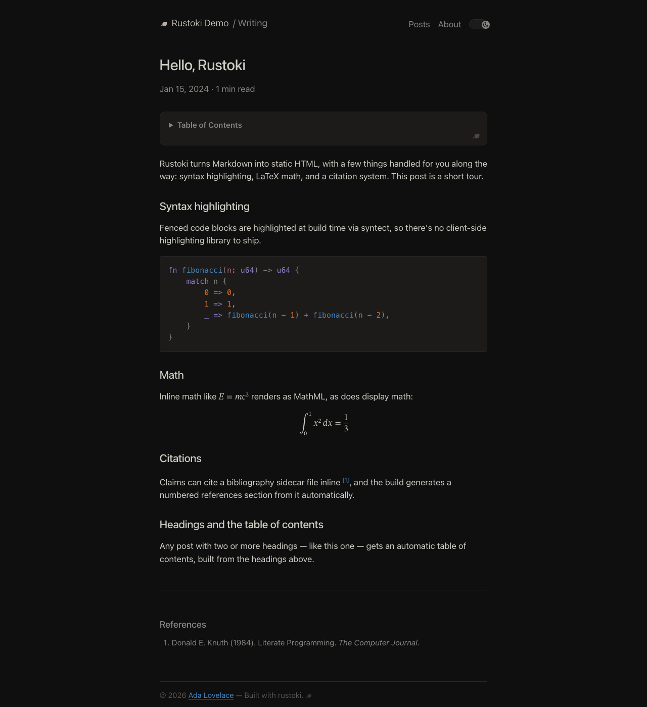
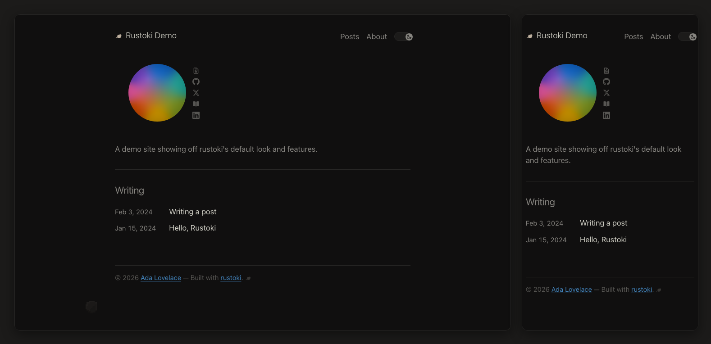

# rustoki

A small, opinionated static site generator written in Rust. Markdown in,
static HTML out—with syntax highlighting, LaTeX math, figures, a
bibliography system, and a [Flexoki](https://github.com/kepano/flexoki)-[themed](https://stephango.com/about#colophon) default look baked in.

Built to power a single personal blog; extracted here so the generator can be
installed and reused independently of that blog's content.



## Design

Rustoki is built around one idea: a static site should stay static. Nothing
that can be resolved at build time is deferred to the reader's browser.

- **One binary, no runtime.** `cargo install` produces a single ~6.5 MB
  executable — no Node, no npm install, nothing to provision on a CI runner
  beyond the Rust toolchain. It's built on a small set of focused crates
  (minijinja, pulldown-cmark, syntect, pulldown-latex — 16 direct
  dependencies in total), not a plugin ecosystem.
- **Rendering happens once, at build time.** Syntax highlighting (syntect),
  LaTeX → MathML (pulldown-latex), and tweet embeds are all fully resolved
  into plain HTML during `build`. None of it ships as client-side
  JavaScript or waits on a third-party script at request time.
- **One inlined stylesheet, zero extra requests.** CSS is compiled into the
  binary and inlined into every page's `<head>` — no separate stylesheet
  fetch, no flash of unstyled content.
- **Images are optimized, not just copied.** Every image is downscaled and
  re-encoded to WebP at build time, with intrinsic `width`/`height` and lazy
  loading set automatically — a 2.4 MB screenshot ships as ~25 KB, and the
  full-resolution original is still one click away.
- **Almost no client-side JavaScript.** The only script on a page by default
  is a ~1.3 KB inline theme toggle; the rest is plain HTML and CSS. (Opting
  into giscus comments is the one exception — that pulls in a third-party
  script on post pages. The optional margin figure adds an inline runtime,
  but still no request.)
- **Small, self-contained pages.** The post rendered above — code block,
  display math, and a references section — is ~22 KB of HTML, CSS included,
  in a single request.

## Usage

Run these from the root of a site directory (one containing `content/`):

```sh
# Install a specific tagged release (recommended — see Releasing below)
cargo install --git https://github.com/alcazar90/rustoki --tag v0.1.0 --locked

# Or track the default branch instead of a pinned release
cargo install --git https://github.com/alcazar90/rustoki --locked

# Build content/ -> public/
rustoki build

# Build including draft: true posts, for local preview only
rustoki build --drafts

# Build (optionally --drafts), then serve public/ at http://127.0.0.1:8000/
rustoki serve --drafts
rustoki serve --port 3000

# Scaffold a new post at content/posts/YYYY-MM-DD-<slug>.md
rustoki new-post "My Post Title"
```

For local development against this repo instead of a published version:

```sh
cargo install --path /path/to/rustoki --locked
```

## What a site needs

- `content/config.toml` — site config (see `src/config.rs` for the schema).
- `content/posts/*.md`, `content/pages/*.md` — Markdown with YAML or TOML
  frontmatter (`title`, `date`, `slug`, `tags`, `description`, `draft`,
  `lang`).
- `content/static/` — copied verbatim into `public/`; images are optimized to
  WebP derivatives at build time (requires `cwebp`/`gif2webp` on `PATH`, e.g.
  `brew install webp` / `apt-get install -y webp` — the build still succeeds
  without them, just ships images unoptimized).
- Optional `content/posts/<post-stem>.refs.yaml` bibliography sidecars for
  `\cite{key}`/`\citep{key}`.
- Optional `[margin]` block for the margin figure (see below).

Templates and CSS are compiled into the binary (`include_str!`) — there's no
runtime template loading or per-site theming. If you want a different look,
fork this repo.

## The margin figure

Off by default. Add a `[margin]` block to `content/config.toml` and a small
pixel traveller crosses the page's side gutter every few minutes: he walks up
the margin, stops once at a waystone, looks back, and dissolves. Then the
margin is empty again for four to seven minutes.

```toml
[margin]
# every field is optional; this is the full set with its defaults
character   = "traveller"   # see src/margin/cast.rs for the roster
scale       = 2.5           # CSS pixels per sprite pixel
first_delay = 90            # seconds before the first crossing
interval    = [240, 420]    # seconds between crossings, picked at random
# min_width = 897           # defaults to whatever this character at this
                            # scale actually needs; below it, nothing plays
```

The sprite's colours are literal and never change. What changes is the
atmosphere, and each theme gets exactly one element: in light mode a long
raking shadow, without which the figure floats on blank paper; in dark mode a
lantern pool, without which a black-outlined sprite on a black page isn't
legible at all. The theme toggle is, in effect, a time-of-day control.

Cost is about **3.9 KB gzipped per page** — atlas, stylesheet and runtime,
all inlined, no extra requests. While idle it holds one `setTimeout`; a
crossing animates `transform` and `opacity` only, never layout or paint. There
are no scroll or resize listeners, `prefers-reduced-motion` gets a single
still frame and never animates, and a hidden tab defers rather than playing to
nobody. Layout shift is structurally zero — the stage is fixed-position and
never enters the text column.

**It does not appear on phones.** At `body { max-width: 700px }` a narrow
viewport has no gutter to walk in, so the crossing never fires. The bytes
still ship, which is the honest cost of inlining. Leave `[margin]` out if your
readers are mostly on mobile.

Adding a second character is adding a `Character` const to `CAST` in
`src/margin/cast.rs`; adding a new choreography is adding a `Routine` to
`src/margin/routine.rs`. Frames are addressed by role (`walk_a`, `walk_b`,
`face`, `rest`), so a routine plays on any character that has the roles it
names, and one that asks for a missing role is dropped at build time with a
warning rather than rendering a blank sprite. Neither the template, the
stylesheet nor the runtime script needs to change.

## Example

`example/` is a small demo site (config, two posts, a page, a bibliography
sidecar) used to exercise and preview the generator. Build and serve it the
same way you would any other site, pointing `cargo run` at this repo's
manifest:

```sh
cd example
cargo run --manifest-path ../Cargo.toml --release -- serve --port 8123
```

Then open `http://127.0.0.1:8123/`. The home page lists both demo posts:



`example/content/config.toml` shows the minimal config needed to get a site
running — title, url, author, description, and a menu. `avatar` and
`[social]` are both optional; leaving them out (as the example does) drops
the avatar image and lays the social-links row out without it.

## Development

```sh
cargo test
cargo fmt
cargo clippy
```

### Releasing

`Cargo.toml`'s `version` is the only source of truth — no changelog file,
no release tooling. To cut a release:

```sh
# 1. Bump `version` in Cargo.toml, commit it
git commit -am "chore: bump version to 0.2.0"

# 2. Tag it
git tag -a v0.2.0 -m "v0.2.0"
git push origin main --tags

# 3. In a consuming site, pin to the new tag
cargo install --git https://github.com/alcazar90/rustoki --tag v0.2.0 --locked
```

Pre-1.0, don't over-think semver strictness: bump the middle number for any
notable change (feature or breaking), the last for trivial fixes. A
consuming site should always pin `--tag`, never track a branch — that way
shipping a new rustoki feature is a deliberate one-line version bump in that
site's own repo, not something that happens silently on its next unrelated
deploy.

## Credits

The default color palette is [Flexoki](https://github.com/kepano/flexoki) by
[Steph Ango](https://stephango.com/flexoki), used under the MIT License. 

## License

MIT
